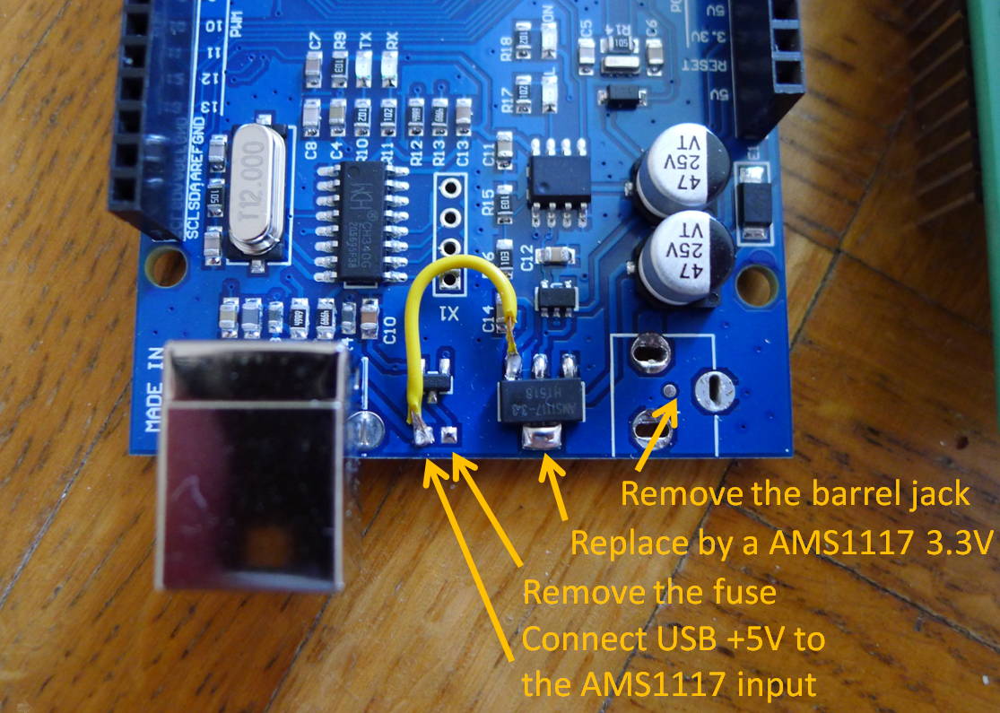

# Arduino Mega EEPROM/Flash burner for some common PSOP44 chips

An Arduino Mega 2560-based programmer for 3.3V parallel flash/EPROM chips used in cartridge-repro projects (Neo Geo, SNES/SFC, etc.), controlled from a Python host over serial: check chip ID, erase, write a ROM file, read back, and verify. It can easily be modified to handle other PSOP44 chips as long as they operate at 3.3V only.

**The project is made to be as simple and portable as possible.** There is no fancy GUI, not a ton of options, just the bare necessary features to test / read / burn your chips. I just wanted a 100% reliable tool.

List of chips supported to date:
- MX29L3211 @PSOP44
- MX29LV320 @PSOP44
- MX26L6420 @PSOP44


## 1. Origin

I've made this project because I had an urgent need to read / write the three chips supported here for a [Neo Geo bootleg project](https://github.com/Raphael-Boichot/Neo-Geo-Sengoku-2-Red-Blood). Using a [Sanni Cartreader](https://github.com/sanni/cartreader) was an option, this is a great project, but not for me right now: too complicated (it does everything fine but requires too much adapters / configuration).

This project originates from the more straightforward [maximaas/MegaBurner](https://github.com/maximaas/MegaBurner), a Java + SWT desktop application built to flash specifically the MX29L3211 chip for SNES/SFC cartridge reproductions, talking to an Arduino Mega 2560 over serial. The original Java / Arduino codebase has however a hell of outdated dependencies (the project was made in 2017) and is not portable at all due to the libraries required for the GUI. After compiling the Java code, I came to the conclusion that I needed something less fancy and easier to debug. So:

- **I translated the Java host application into the simpliest possible Python code** — a small, dependency-light (`pyserial` only) command-line driver and a couple of ready-to-run scripts, replacing the SWT GUI app.
- **I expanded chip support for my needs** beyond the original single MX29L3211 target, adding the MX29LV320E (Top-Boot and Bottom-Boot) and the MX26L6420, each verified against its own datasheet rather than assumed to behave like the others — they don't always agree on unlock addresses, program granularity, reset sequences, or even bus width quirks, and a few real bugs (busy-polling, hardware pin-swap workarounds) turned up along the way.
- **I reworked the Arduino firmware** so chip selection happens at **runtime**, over serial, instead of needing a firmware reflash every time you swap chips.
- **I bullet-proofed the tool chain** with lots of endurance runs on real chips before using it with success.

As it, adding new chips is quite simple. As I can only add chips that I own for testing, the list is quite restricted for now. 

## 2. Hardware: the Arduino Mega 3.3V mod

All the chips this project targets are **3V/3.3V parts**. The Arduino Mega 2560 runs its logic at 5V by default, and driving a 3.3V-only flash chip inputs at 5V is outside the chip rated I/O voltage. The fix used in this project is to modify the Arduino Mega itself to run at 3.3V, rather than adding external level-shifters.

See the picture below for exactly how this board was modified (Chinese clone here, mod is very easy):



If you're using an official Arduino product, follow the [Adafruit guide](https://learn.adafruit.com/arduino-tips-tricks-and-techniques/3-3v-conversion) as the voltage regulator is not the same. As you can see, I took some shortcuts with my clone as it will basically be used only for a single task.

The usual approach is anyway to bypass / replace the Mega onboard 5V regulator with a 3.3V one, so every I/O pin - not just some of
them - runs at the chip-safe voltage. Double check your specific board regulator pinout before doing this swap (mine was the same as the AMS1117 3.3V required here). Running an ATmega2560 at 3.3V has a lower maximum clock frequency than at 5V. It does not affect this project at all.

Arduino Mega are dirt cheap on second hand market, in particular Chinese clones, so I recommend butchering an old one rather than a new. Mine was sold as "working" with the voltage regulator completely charred, exactly what I needed for the mod.

## 3. Hardware: crafting the device


Just strictly follow the pinout given here. It requires lots of spaghetti wiring but it does not justify making a dedicated PCB because mess of wires are cool. Just use the cheapest generic Arduino Mega shield and solder.

You can add a red LED connected to D12 (Writing) and a green LED connected to D13 (Reading) to have real time information from the board itself. Use 360 Ohms resistors to protect them.


The PSOP44 to DIP44 adapter is a generic brand from Amazon, nothing fancy. I've mounted it on pin headers in order to be able to change it without wasting the shield. Double check each connection with a multimeter before attempting any burn.

## 4. Arduino firmware structure

The sketch lives under `Arduino_MegaBurner/`. Rough shape:

| File | Role |
|------|------|
| `MegaBurner_arduino.ino` | Main sketch: serial command dispatch (`C`/`R`/`E`/`W`/`S`), the two activity LEDs (D12 = write, D13 = read), the startup "I'm alive" LED flash, and runtime chip selection via the `activeChip` pointer. |
| `FlashChip.h` | Abstract base class every chip driver implements (`init`, `readId`, `reset`, `read16`, `write16`, `erase`) — this is what makes runtime chip switching possible. |
| `MX29L3211.h` / `.ino` | Driver for the MX29L3211 (has a real multi-word page-buffer program feature). |
| `MX29LV320E.h` / `.ino` | Driver for MX29LV320E Top-Boot/Bottom-Boot (single-word program only; one driver covers both boot variants — they only differ in silicon ID, not command set). |
| `MX26L6420.h` / `.ino` | Driver for the MX26L6420 MTP EPROM (16-bit only, different reset sequence, and a documented WE#/A21 pin-swap workaround specific to this chip on the shared 44-SOP socket — see the comments at the top of this file). |
| `MegaBurner.h` | Small string-splitting helper used to parse command parameters. |

**Serial protocol** (all commands are plain ASCII over a 115200 baud
connection):

| Command | Meaning | Reply |
|---------|---------|-------|
| `C` | Check chip ID | 4 ASCII hex characters, zero-padded (e.g. `C2FC`) |
| `R<block>,<size>` | Read one block | `<size>` raw bytes |
| `E` | Erase the whole chip | `%` once done |
| `W<offset>,<page>,<n>` | Write `n` bytes at `offset` | `&` when ready to receive, then `n` raw bytes, then `%` when done |
| `S<name>` | Select which chip driver is active (e.g. `SMX26L6420`) | `%` once that chip's `init()` completes |

### Adding a chip to the Arduino side

1. **Get the real datasheet.** Never assume a new chip shares another one's command set just because it's the same package or a similar part number. At minimum, confirm: unlock addresses, whether it has a page-buffer program feature or only single-word program, how busy/done status is polled (a fixed address vs. the address you're actually writing to; DQ7 alone vs. DQ7+DQ6 together), and the exact reset sequence.
2. Copy `MX26L6420.h`/`.ino` as a template and adjust for the new chip's actual sequences, inheriting from `FlashChip`.
3. In `MegaBurner_arduino.ino`: `#include` the new header, instantiate the chip object, and add an `else if` branch to `selectChip()`.
4. Reflash, then verify with a read-only check (chip ID, then a read) before ever trying an erase/write on real hardware.

## 5. Python host

The host code lives under `Python_MegaBurner/`, structured as a small package plus two ready-to-run scripts. Only dependency: `pyserial`
(`pip install pyserial`).

| File | Role |
|------|------|
| `megaburner/driver.py` | `MegaBurner` class: connect, check, erase, write, read, verify. One-to-one port of the serial protocol above. |
| `megaburner/chips.py` | The chip database — one `Chip` entry per supported chip/variant. |
| `megaburner/fileio.py` | Load/save ROM files, random test-data generation. |
| `megaburner/progress.py` | Plain console progress bar/spinner (no extra dependencies). |
| `test_megaburner.py` | Full round-trip test: connect → check ID → erase → write → read back → CRC32 compare. Config (COM port, chip, ROM file or random test data) is edited directly at the top of the script — no command-line arguments to remember. |
| `dump_chip.py` | Read-only: connect → check ID → read → save to a file. No erase, no write — useful for a first look at a chip or just backing up a cart. |

### Using it

Open either script, edit the configuration block at the top (at minimum the COM port and which chip you're using — a commented list of
supported chips is right there in the file), then run it:

```
python dump_chip.py
python full_cycle_chip.py
```

I strongly recommend running and editing scripts from VScode. Both scripts create their output files (ROM dumps, readback files) next to the script itself, regardless of what folder you launched Python from. The code is voluntarily "script only" to keep the project as much portable as possible.

The code is very slow due to the way the serial is used but who cares: it works !

### Adding a chip to the Python side

Add a `Chip(...)` entry to `megaburner/chips.py`. Every field is required and documented in that file's dataclass — in short: `id` (the ASCII string the firmware's `C` command returns), `capacity`, `page_size` (must match what the Arduino driver actually implements, not be picked independently), and `firmware_id` (the name you send with the `S` command, matching what you added to `selectChip()` on the Arduino side). Optional fields (`package`, `max_cycles`, `notes`) are there for anything worth flagging — an unusually low erase/program cycle limit, a known quirk, etc.

## Acknowledgements

- [maximaas](https://github.com/maximaas) for the original [MegaBurner](https://github.com/maximaas/MegaBurner) project this is built on.
- [sanni](https://github.com/sanni) for the [Cart Reader](https://github.com/sanni/cartreader) and its huge amount of open documentation.
- Claude AI, without which this project would have taken up far too much of my free time – which has already been the case, given the sheer volume of hardware tests, feedbacks and manual checks that needed to be carried out before releasing this project in the wild.
